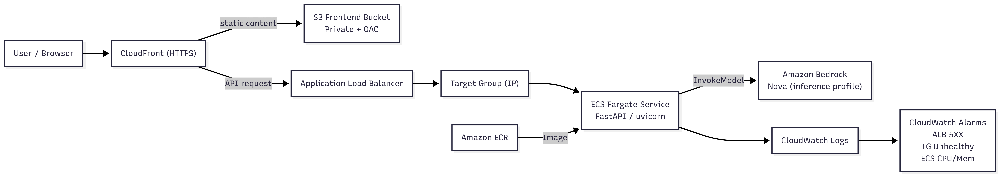

# AI Q&A Chatbot on AWS  
（工程導向練習專案，Work In Progress）

本專案為一個 **工程導向（Engineering-focused）** 的練習專案，  
目標是透過 Infrastructure as Code（Pulumi）與 AWS 雲端原生服務，  
逐步建構一個 **可部署、可更新、可完整銷毀（full lifecycle）** 的 AI 問答系統。

本專案刻意以「真實工程流程」推進，而非一次性完成所有功能。

> 📌 本 README 為「活文件（Living Document）」  
> 用來記錄目前已完成狀態、設計決策、工程取捨與下一步規劃，  
> 而非最終使用者操作手冊。

---

## 專案目標（Project Goals）

- 使用 Pulumi 管理 AWS 基礎設施（Infrastructure as Code）
- 建立可對外服務的後端 API（FastAPI）
- 導入並驗證 CI/CD 自動化部署流程
- 整合 Amazon Bedrock 提供 AI 問答能力
- 演進式收斂 IAM 權限（least privilege）
- 練習雲端系統的工程化建置與維運思維

---

## 與題目要求的對齊說明（Assignment Alignment）

本專案對齊以下題目要求進行設計與實作：

- 使用 Pulumi 進行 IaC 管理
- 使用 Ansible 進行自動化部署與驗證
- AWS 架構包含：
  - Application Load Balancer（ALB）
  - ECS Fargate
  - Amazon ECR
  - Amazon S3
  - CloudFront
  - Amazon Bedrock
- 關注重點：
  - IaC
  - CI/CD
  - Observability（o11y）
  - IAM least-privilege
- 系統支援完整生命週期（deploy / update / destroy）

---


## 高階架構概覽（High-Level Architecture）



### 已完成架構

使用者 / Browser  
→ CloudFront（HTTPS）

- `/`
  - → S3 靜態前端網站（Private Bucket + Origin Access Control）

- `/api/*`
  - → Application Load Balancer
  - → ECS Fargate（FastAPI）
  - → Amazon Bedrock（Nova model via inference profile）

其他元件：

- Container image 儲存在 Amazon ECR
- 應用程式日誌輸出至 CloudWatch Logs
- 關鍵服務具備基礎監控與告警（Phase 7）

---

## 目前進度（Current Status）

### 環境資訊

- Pulumi Stacks：
  - dev（常駐，用於開發與驗證）
  - prod（已驗證可建立與銷毀，目前為保持帳號乾淨已 destroy）
- AWS Region：ap-northeast-1（Tokyo）
- Backend Runtime：ECS Fargate

### 已確認資源（Pulumi Stack Outputs）

- S3 Bucket（assets）
- S3 Bucket（frontend）
- ECR Repository
- ECS Cluster（隨 stack recreate 變動）
- ECS Service（隨 stack recreate 變動）
- ALB DNS（隨 stack recreate 變動）
- CloudFront Domain（隨 stack recreate 變動）

### 查詢指令（建議在 repo 根目錄執行）

```bash

cd infra

pulumi stack output ecs_cluster_name
pulumi stack output ecs_service_name
pulumi stack output alb_dns_name
pulumi stack output cloudfront_domain_name 
```

## How to Use This Repository

本專案設計為可在「全新、乾淨的 AWS 帳號」中重現。  
以下說明如何使用本 repository 所提供的材料（Pulumi、Ansible、CI/CD pipeline），  
完成基礎設施建立、應用程式部署，以及系統驗證。

### Prerequisites（使用前準備）

- 一個可使用的 AWS 帳號
- 已設定完成的 AWS CLI（具備必要權限）
- Pulumi CLI
- Ansible
- Docker
- GitHub 帳號（用於 CI/CD）

### High-level Usage Flow（使用流程概覽）

1. Clone 本 repository。
2. 使用 Pulumi 建立或更新基礎設施。
3. 透過 CI/CD pipeline 建置並部署應用程式。
4. 透過提供的 endpoint 驗證系統是否正常運作。
5. （選擇性）銷毀並重新建立環境，以驗證完整生命週期。

更詳細的逐步操作說明，請參考 `docs/lifecycle.md`。


## Phase 2 – Backend on AWS（已完成）

### 架構摘要

- 使用 Pulumi 建立 ECS Fargate + Application Load Balancer
- FastAPI（uvicorn）作為後端 API
- ALB 透過 Target Group（IP mode）將流量導向 ECS Task

### 健康檢查（Health Check）

- Endpoint：`GET /health`
- 預期回應：HTTP 200
- 狀態：Target Group 顯示為 Healthy（已驗證）

---

## Phase 3 – CI/CD Automation（Build）（已完成）

### GitHub Actions – Build Pipeline

- 自動 build container image
- push image 至 Amazon ECR
- image tag 以 git commit SHA 標記
- 不在 CI 直接修改基礎設施

GitHub Actions 在此階段負責 CI（build / image push）與流程 orchestration，
不直接執行 runtime 部署。


---

### Multi-environment CI/CD（dev / prod）

本專案支援 dev / prod 兩個環境，CI/CD 亦採相同的環境隔離原則：

- dev / prod 使用不同的 GitHub Actions workflow（或以 workflow inputs 區分）
- 使用不同的 IAM role，避免 dev pipeline 影響 prod：
  - `ai-qa-chatbot-ci-deploy-dev`
  - `ai-qa-chatbot-ci-deploy-prod`
- Frontend S3 bucket 與 ECS service 皆依環境區隔
- 實際部署目標（cluster / service / bucket）皆由 Pulumi stack outputs 動態取得


## Phase 4 – Frontend on CloudFront + S3（已完成）

- S3 Private Bucket + CloudFront Origin Access Control
- `/` → 前端靜態頁面
- `/api/*` → ALB 後端 API
- 前後端同域，避免 mixed content 問題

---

## Phase 5 – Amazon Bedrock（AI Q&A）（已完成）

- Endpoint：`POST /api/chat`

### 呼叫路徑設計

**Deterministic path**

- 特定問題（例如時間查詢）由後端直接處理

**AI inference path**

- 透過 Amazon Bedrock 呼叫 Nova model
- 使用 inference profile（非 on-demand model ID）
- Bedrock 呼叫權限僅存在於 ECS Task Role

---

## Phase 6 – Ansible-based Continuous Deployment（已完成）

本專案使用 Ansible 作為實際的 Continuous Deployment（CD）執行引擎，  
由 GitHub Actions 在 pipeline 中呼叫。

GitHub Actions 負責 CI（build / test / image push）與 pipeline orchestration；  
實際的部署行為（更新 ECS service）由 Ansible playbook 執行，作為 CD engine。


### 實際 CI / CD 流程

GitHub Actions  
→ Build & Push image  
→ 呼叫 Ansible CD deploy  
→ 呼叫 Ansible smoke test（release gate）

### Ansible CD（Deploy）

由 `ansible/playbooks/ansible_cd_deploy.yml` 實作：

- 不透過 SSH
- 不建立或修改基礎設施
- 動態取得 ECS cluster / service（Pulumi outputs）
- 取得並更新 task definition
- 更新 ECS service
- 等待 service 穩定

---

## Phase 6.5 – Post-deploy Smoke Test（Release Gate）（已完成）

部署完成後，GitHub Actions 會呼叫第二支 Ansible playbook，  
作為 post-deploy black-box smoke test 與 release gate。

由 `ansible/playbooks/ansible_cd_smoke.yml` 實作，  
驗證對象為實際對外服務（CloudFront entrypoint）。

### 驗證項目

- Frontend（CloudFront `/`，best-effort）
- Backend health check（`/api/health`）
- Chat API deterministic path
- Chat API Bedrock inference path

Smoke test 任一項失敗，即視為 deploy 失敗。
---

## Phase 6.8 – Frontend Deployment via CI/CD（已完成）

前端靜態網站的部署已正式納入 CI/CD pipeline，
由 GitHub Actions 在同一條 deploy workflow 中執行。

### 部署方式

- 前端檔案來源：`frontend/index.html`
- 部署目標：S3 bucket（frontend）
- 對外服務入口：CloudFront（與 `/api/*` 共用同一網域）

### 快取策略設計（重要）

為避免 CloudFront / browser cache 導致前端更新未即時反映，
前端部署採用以下策略：

- **`index.html`**
  - 設定為 `no-cache, no-store, must-revalidate`
  - 確保每次部署後 UI 可立即更新
- **其餘靜態資源（如未來的 JS/CSS）**
  - 採用長快取（`max-age=31536000, immutable`）

### 實作重點

- 前端部署與 backend deploy 位於同一條 CD pipeline
- 避免人為手動上傳 S3
- 修正早期「CI 已跑但前端畫面未更新」的實務問題

此設計同時兼顧：
- CDN 效能
- UI 更新即時性
- 工程可維運性

---

## Phase 7 – Observability（已完成）

導入 Minimum Viable Observability（MVO）。

### 已實作告警（CloudWatch Alarms）

- ALB 5XX（ELB generated）
- Target Group Unhealthy（HealthyHostCount < 1）
- ECS CPU High（>= 80%, 3 minutes）
- ECS Memory High（>= 80%, 3 minutes）

所有告警皆由 Pulumi 管理，  
並隨 stack 生命週期建立 / 更新 / 銷毀。

---

## Phase 8 – IAM Least Privilege（已完成）

針對 Infra / CI / Runtime / Observer 進行角色拆分與權限收斂，  
確保系統在最小權限設計下仍可完成完整生命週期。

### IAM 角色分工

**Infra Admin（Pulumi Operator）**

- 用途：`pulumi preview / up / destroy`
- 權限：AdministratorAccess（demo / 練習環境）

**CI/CD Deploy Role（GitHub Actions）**

- OIDC Assume Role
- 權限：
  - ECR push
  - ECS RegisterTaskDefinition / UpdateService
  - 限定範圍 `iam:PassRole`
  - **Frontend S3 deploy（限定單一 bucket）**
- 不具備 Bedrock 權限

Frontend S3 權限實作說明：

- 另行建立最小權限 policy（例如：`ai-qa-chatbot-ci-frontend-s3-dev`）
- 僅允許以下行為：
  - `s3:ListBucket`
  - `s3:PutObject`
  - `s3:DeleteObject`
- Resource 限定於指定 frontend bucket ARN
- 支援 `aws s3 sync --delete`，但不具備跨 bucket 存取能力


**Runtime Role（ECS Task Role）**

- 僅允許：
  - `bedrock:InvokeModel`
- Resource 限定：
  - 指定 Nova inference profile
  - 對應 foundation model ARN

**Observer**

- `ReadOnlyAccess`
- 僅供觀測，不可修改

---

## Infrastructure Lifecycle（IaC）

本專案使用 Pulumi 管理所有 AWS 基礎設施，  
並刻意驗證 **完整生命週期（create / update / destroy）** 的可行性。

### Provision / Update

- `pulumi preview`  
  用於檢視即將變更的基礎設施，作為變更前的安全檢查。
- `pulumi up`  
  實際建立或更新基礎設施（ECS、ALB、CloudFront、S3、IAM 等）。

Pulumi 僅在以下情境執行：

- 環境首次建立（dev / prod stack）
- 基礎設施設計變更
- 完整環境重建（recreate）

日常應用程式部署 **不會** 透過 Pulumi 進行。

### Destroy / Recreate

- `pulumi destroy`  
  用於完整移除該 stack 所建立的 AWS 資源，  
  以驗證基礎設施可被乾淨銷毀，並可隨時透過 IaC 重建。

確認所有 由 Pulumi 管理的資源（ECS、ALB、CloudFront、S3、ECR、IAM）
皆可由 IaC 完整管理並移除。

### Design Principle

- 基礎設施與應用程式部署責任分離  
- Pulumi 專注於 infrastructure lifecycle  
- CI/CD pipeline 專注於 application delivery  
- 避免隱性自動化，確保變更可預期、可追蹤

---

## Repository Hygiene

- 不提交任何憑證
- CI 不使用長期 access key
- Repo 可被第三方 clone 並完整重現

---

## Roadmap

- [x] Backend on ECS + ALB
- [x] CI build pipeline
- [x] Ansible-based CD
- [x] Post-deploy smoke test
- [x] CloudFront + S3 frontend
- [x] Amazon Bedrock integration
- [x] Observability
- [x] IAM least-privilege hardening
- [x] Multi-environment（dev / prod stack supported）
- [x] 架構圖補齊
